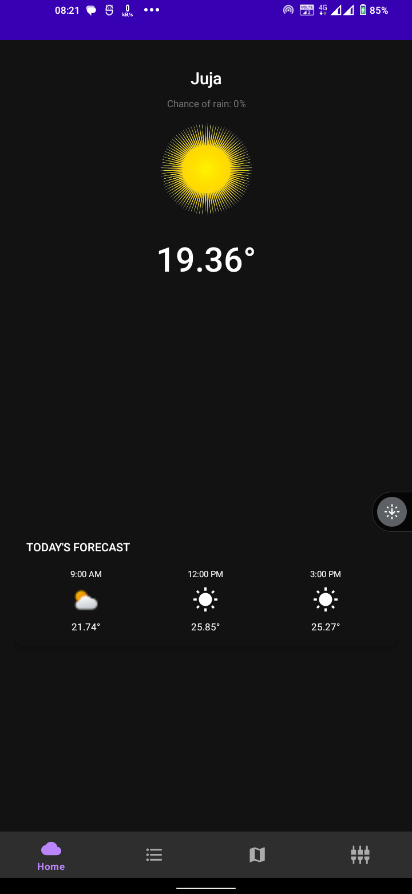
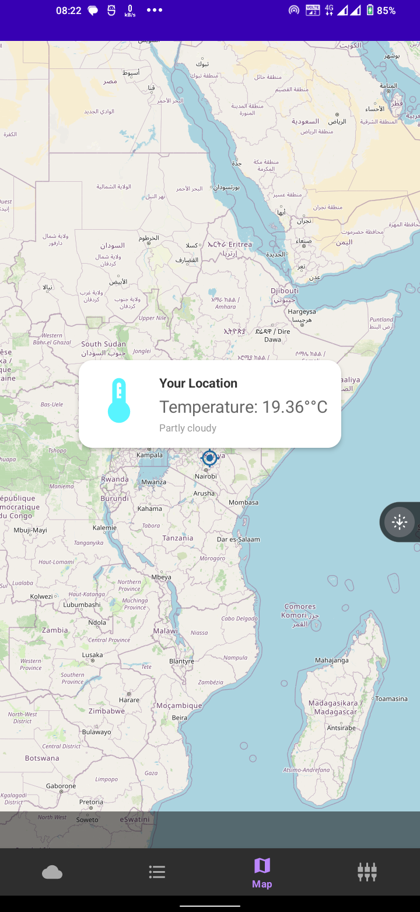
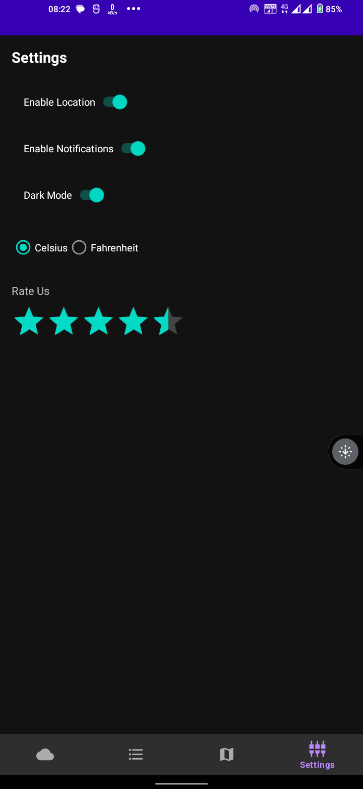

# 🌤️ WeatherNow App

   

**WeatherNow** is a simple and modern weather app built with Kotlin on Android Studio. It allows users to view current weather data based on their location or other cities they add. Powered by [OpenWeather API](https://openweathermap.org/api).

## Features 🌟
- **Current Location Weather**: Automatically fetches and shows weather for the user's current location.
- **Add Cities**: Users can add cities to view weather data for multiple locations.
- **Dynamic Icons**: Weather icons change based on conditions (e.g., sunny, cloudy) using assets from [Flaticon](https://www.flaticon.com/).
- **Material UI Design**: Clean and modern design using Material UI components.
- **Weather Details**: Shows temperature, humidity, wind speed, and more.

## Technologies Used 🚀
- **Kotlin**: The primary programming language.
- **OpenWeather API**: To fetch real-time weather data.
- **Retrofit & Gson**: For making HTTP requests and handling JSON responses.
- **Material UI**: For the app’s layout and design.
- **Flaticon Icons**: Used for weather conditions icons.

## Screenshots 📸
Here are a few screenshots of the app in action:

| Current Weather | Add Cities |
| --- | --- |
|  |  |

## How to Install & Run 🛠️
To run this project locally:

1. Clone the repository:
    ```bash
    git clone https://github.com/yourusername/weather-app.git
    cd weather-app
    ```

2. Open in Android Studio and sync Gradle files.

3. Add your OpenWeather API Key to the `gradle.properties` file:
    ```properties
    OPENWEATHER_API_KEY=your_api_key_here
    ```

4. Run the project on an emulator or device.

## API Setup 🔗
You’ll need an API key from [OpenWeather API](https://openweathermap.org/api). Sign up, get your key, and add it to the project.

## Screenshots





## Contributing 🤝
Pull requests are welcome! For major changes, please open an issue first to discuss what you would like to change.

## License 📜
This project is licensed under the MIT License - see the [LICENSE](LICENSE) file for details.
